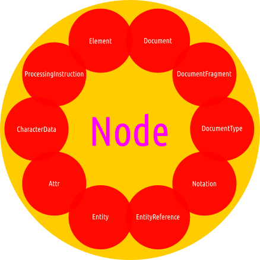

# Interfața `Node` - fundamentală

Nodurile sunt unitățile care constituie părțile constructive ale DOM-ului. Aceste noduri sunt dispuse într-un arbore numit în engleză *node tree*.

Interfața `Node` este considerată a fi o **interfață fundamentală**. În DOM, `Node`-ul este unitatea de bază pentru a accesa datele. Este un reper fix.

`Node` este o interfață de la care moștenesc o serie de tipuri DOM printre care `Document`, `Element`, `CharacterData` (de la care moștenesc la rândul lor `Text`, `Comment` și `CDATASection`), `ProcessingInstruction`, `DocumentFragment`, `DocumentType`, `Notation`, `Entity`, `EntityReference`.



Standardul spune că această interfață este „tipul de dată primar pentru întreg DOM-ul”. Atenție, nu toate nodurile pot avea copii.

Fiecare `node` are două proprietăți care îl descriu: `nodeType` și `nodeName`.

## Moștenire

```mermaid
graph RL;
  Node((Node)) -->|moștenește din| EventTarget;
```


## Tipuri de noduri

Nodurile pot fi noduri de elemente (de ex. elementul `<p>`), noduri de text, care sunt chiar fragmentele text din nodurile elementelor, noduri care reprezintă atribute, de exemplu `class=".modifica"` sau `id="suntUnic"`.

## Mantre

-   Dintre toate proprietățile doar două pot fi și scrise, nu numai să fie citite. Restul pot fi doar citite. Acestea sunt: `Node.nodeValue` și `Node.textContent`.

## Proprietățile Node

### `Node.baseURI`

### `Node.childNodes`

### `Node.firstChild`

### `Node.lastChild`

### `Node.nextSibling`

### `Node.nodeName`

Toate nodurile au această proprietate. De exemplu, pentru nodurile text, valoarea lui `nodeName` va fi `#text`.

### `Node.nodeType`

Returnează un număr care desemnează tipul nodului.

| Nume                        | Valoare |
|:--------------------------- |:------- |
| ELEMENT_NODE                | 1       |
| ATTRIBUTE_NODE              | 2       |
| TEXT_NODE                   | 3       |
| CDATA_SECTION_NODE          | 4       |
| ENTITY_REFERENCE_NODE       | 5       |
| ENTITY_NODE                 | 6       |
| PROCESSING_INSTRUCTION_NODE | 7       |
| COMMENT_NODE                | 8       |
| DOCUMENT_NODE               | 9       |
| DOCUMENT_TYPE_NODE          | 10      |
| DOCUMENT_FRAGMENT_NODE      | 11      |
| NOTATION_NODE               | 12      |

Este o proprietate utilă pentru a determina dacă nodul este de un anumit tip sau nu. Proprietatea va indica o valoare numerică ce corespunde tipului de nod.

```javascript
// <a href="#">un link</a>
console.log(
  document.querySelector('a').nodeName, // A
  document.querySelector('a').nodeType  // 1
);
console.log(document.querySelector('a').nodeType === Node.ELEMENT_NODE); // true
```

### `Node.nodeValue`

Setează valoarea sau extrage valoarea nodului. Această valoare este un șir de caractere care se află în nod, dacă acestea există. Pentru `document` în sine, `nodeValue` returnează `null`. Pentru text, comment și noduri CDATA, `nodeValues` returnează conținutul nodului. Pentru nodurile atribut va fi returnată valoarea acestuia.

Reține faptul că această proprietate returnează textul care este conținut de nod și atunci când se atribuie o valoare nouă, va modifica conținutul nodului.

```javascript
// <a href="#">un link</a>
console.log(document.querySelector('a').firstChild.nodeValue); // un link
```

### `Node.ownerDocument`

### `Node.parentNode`

Returnează elementul care este părintele nodului curent. Dacă nu are părinte, valoarea va fi `null`. Este o proprietate cu ajutorul căreia poți lucra cu părintele unui element în scopul aducerii de modificări în structura acestuia. Scenariul cel mai des întâlnit este cel al adăugării sau eliminării de elemente.

```javascript
var elementReferință = document.querySelect("#cineva");
elementReferință.parentNode.removeChild(elementReferință.parentNode.firstChild);
// va șterge primul element copil din părintele lui elementReferință
```

Cu ajutorul acestei proprietăți poți verifica dacă elementul părinte al celui curent are o anumită clasă sau dacă are date introduse prin atributul `data-*`.

```javascript
if (element.parentNode.classList.contains('suntgalben')) {
  console.log('Sunt un element galben');
}
```

Proprietatea `parentNode` este chainable, adică permite mișcarea pe DOM în sus și în jos.

```javascript
console.log(elementReferință.parentNode.parentNode.nodeName);
```

Poți insera cu precizie un alt element lângă unul țintit.

```javascript
var elementNou = document.createElement('p');
var elementReferință = document.querySelect('#suntreferinta');
elementReferință.parentNode.insertBefore(elementNou, elementReferință.nextSibling);
```

Elementele care încă nu au fost introduse în DOM, nu au proprietatea `parentNode`. În cazul acesta, proprietatea `parentNode` va avea valoarea `null`.

### `Node.parentElement`

### `Node.previousSibling`

Returnează nodul anterior din arbore sau `null`, dacă nu există.

### `Node.rootNode`

Returnează primul nod al arborelui. Ajungi la acest nod din Node.parentElement în Node.parentElement până când ultimul este, de fapt, rootNode.

### `Node.textContent`

Returnează sau setează conținutul de tip text al unui element și a tuturor descendenților acestora.

## Metodele unui Node

### `Node.appendChild()`

Această metodă primește ca argument numele elementului. Acest nod va fi creat ca `lastChild` în ramura în care a fost creat. Dacă argumentul referențiază un nod deja existent, acesta va fi desprins din poziția sa și reatașat în noua poziție (`lastchild`).

### `Node.cloneNode()`

Clonează un nod iar dacă se dorește chiar și conținutul lui. Default-ul clonează și conținutul.

### `Node.compareDocumentPosition()`

### `Node.contains()`

### `Node.getRootNode()`

### `Node.hasChildNodes()`

Indică printr-un Boolean dacă un element are copii sau nu.

### `Node.insertBefore()`

### `Node.isDefaultNamespace()`

### `Node.isEqualNode()`

### `Node.isSameNode()`

### `Node.lookupPrefix()`

### `Node.lookupNamespaceURI()`

### `Node.normalize()`

### `Node.removeChild()`

### `Node.replaceChild()`
