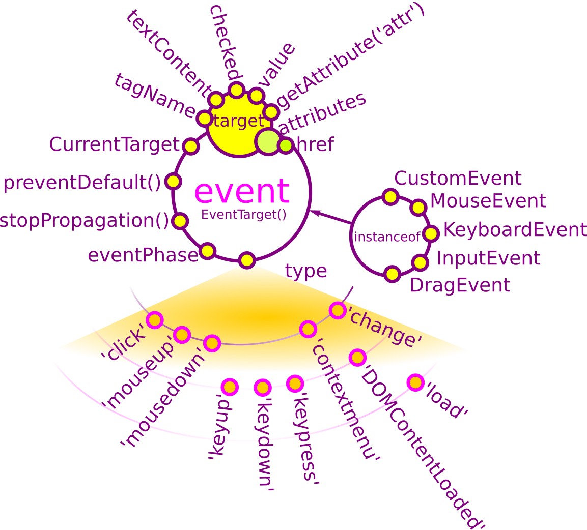

# Event

Această interfață constituie punctul de acces la toate evenimentele apărute în DOM. Evenimentele își pot avea originea în interacțiunea utilizatorului prin tastatură, mouse, etc., sau pot fi generate de API-uri care își fac prezența semnalând o activitate.

Însuși obiectul `Event` conține toate proprietățile și metodele care sunt comune tuturor obiectelor.

## Spune standardul

> Un obiect Event este un eveniment denumit. Acesta semnalizează când ceva s-a întâmplat, de exemplu, s-a terminat de descărcat o imagine.

„Termenul de obiect context se referă la obiectul în care algoritmul, *getter*-ul sau *setter*-ul de proprietate sau metoda care este în discuție au fost apelate”.

## Obiectul `event`

Acest obiect are câteva fanioane care nu sunt setate inițial:

-   oprește propagarea
-   oprește imediat propagarea
-   anulat
-   ascultare pasivă
-   compus
-   inițializat
-   trimis

## Proprietăți și metode ale obiectului eveniment

Vom porni de la felul în care atașăm un event listener pentru a studia obiectul eveniment format.

```javascript
let tinta = document.querySelector('#tinta');
tinta.addEventListener('click', function (eveniment) {
  // eveniment este obiectul pe care DOM îl pasează
  // event handler
})
```



În funcția cu rol de callback este pasat obiectul eveniment denumit în exemplu `eveniment`. Acest obiect expune câteva proprietăți și metode importante.

### eveniment.type

La momentul creării evenimentului, atributul trebuie inițializat cu un șir vid. Type returnează valoarea cu care a fost inițializat evenimentul.

### eveniment.target

Returnează obiectul pentru care s-a atașat evenimentul. Când este creat evenimentul, se va inițializa la `null`.

### eveniment.currentTarget

Avem un event listener (un receptor). Acest event listener are o funcție cu rol de callback. Atunci când este invocată funcția callback, `currentTarget` returnează obiectul în contextul căreia rulează callback-ul la momentul apelării. Este posibil ca ținta să se fi schimbat între timp. Când este creat evenimentul, se va inițializa la `null`.

### eveniment.eventPhase

Indică faza în care se află evenimentul.

-   `Event.NONE` - în nicio fază, codat prin `0`; evenimentul nu este declanșat în acest moment.
-   `Event.CAPTURING_PHASE` - faza de capturare, codat prin `1`; evenimentul este declanșat pentru un obiect care face parte dintr-un arbore. Marchează faza de dinaintea atingerii valorii pentru proprietatea `target`. Evenimentul este propagat din obiect părinte în obiect părinte pornind de la `Window` -> `Document` -> `HTMLHtmlElement` ș.a.m.d până la părintele țintei. Receptorii de evenimente (event listeners) sunt în faza de captură și vor fi apelate callbackurile lor de îndată ce va fi apelat `țintaEvenimentului.addEventListener()`.
-   `Event.AT_TARGET` - a ajuns la țintă, codat prin `2`; evenimentul a ajuns la țintă și a fost setată valoarea pentru proprietatea `target`. În acest moment, dacă `numeEveniment.bubbles` are valoarea `false`, procesarea evenimentului se încheie după această fază.
-   `Event.BUBBLING_PHASE` - faza de bubbling, codată prin `3`; evenimentul a ajuns la țintă deja și s-a setat valoarea pentru proprietatea `target`. Dacă `numeEveniment.bubbles` are valoarea `true`, evenimentul se propagă din părinte în părinte până la `Window` declanșând toți receptorii de eveniment setați pentru faza de bubbling.

### eveniment.stopPropagation()

Invocarea acestei metode într-un arbore conduce la oprirea propagării evenimentului dincolo de obiectul curent. Invocarea acestei metode conduce la setarea fanionului „stop propagation” care aparține obiectului context.

### eveniment.stopImmediatePropagation()

Metoda este invocată atunci când ai nevoie să împiedici propagarea evenimentului imediat după ce funcțiile callback pentru receptorii de eveniment ai nodului curent la care evenimentul a ajuns, și-au încheiat execuția.
Pentru a înțelege mai ușor, să presupunem că avem mai mulți receptori (*event listeners*) pentru același element și pentru același tip de eveniment. Aceștia sunt apelați în ordinea adăugării lor dar dacă în timpul unui astfel de apel `numeEveniment.stopImmediatePropagation()` a fost invocat, receptorii rămași nu vor mai fi apelați.

### eveniment.bubbles

Proprietatea returnează `true` sau `false` în funcție de modul în care a fost inițializat evenimentul. Dacă este `true`, atunci evenimentul se va propaga înapoi către `Window`; pe scurt, face bubbling.

### eveniment.cancelable

Indică printr-un boolean dacă un eveniment poate fi anulat sau nu. Verificarea dacă un eveniment poate fi anulat sau nu, este ceva ce poate fi determinat la momentul inițierii evenimentului.

### eveniment.preventDefault()

Această metodă spune browserului că de nu există nimic care să gestioneze evenimentul, acesta să nu producă efectele. Totuși, evenimentul se va propaga cu specificația că nu va produce niciun efect, iar dacă va da peste un event listener care apelează `stopPropagation()`, evenimentul va fi oprit din propagare.
Atenție, funcționează doar dacă proprietatea `cancelable` este setată la `true`.

### eveniment.defaultPrevented

Returnează `true` dacă a fost invocată `preventDefault()`.

### eveniment.composed

Returnează `true` sau `false` în funcție de modul în care a fost inițializat evenimentul. Este `true`, dacă s-a trecut din shadow DOM în DOM normal.

### eveniment.isTrusted

Returnează `true` dacă evenimentul a fost emis de browser.

### eveniment.timeStamp

Returnează timpul la care a apărut evenimentul.

## Interfețe care depind

O serie de interfețe depind de aceasta pentru a implementa propria funcționare. Acestea sunt:

    AnimationEvent
    AudioProcessingEvent
    BeforeInputEvent
    BeforeUnloadEvent
    BlobEvent
    ClipboardEvent
    CloseEvent
    CompositionEvent
    CSSFontFaceLoadEvent
    CustomEvent
    DeviceLightEvent
    DeviceMotionEvent
    DeviceOrientationEvent
    DeviceProximityEvent
    DOMTransactionEvent
    DragEvent
    EditingBeforeInputEvent
    ErrorEvent
    FetchEvent
    FocusEvent
    GamepadEvent
    HashChangeEvent
    IDBVersionChangeEvent
    InputEvent
    KeyboardEvent
    MediaStreamEvent
    MessageEvent
    MouseEvent
    MutationEvent
    OfflineAudioCompletionEvent
    OverconstrainedError
    PageTransitionEvent
    PaymentRequestUpdateEvent
    PointerEvent
    PopStateEvent
    ProgressEvent
    RelatedEvent
    RTCDataChannelEvent
    RTCIdentityErrorEvent
    RTCIdentityEvent
    RTCPeerConnectionIceEvent
    SensorEvent
    StorageEvent
    SVGEvent
    SVGZoomEvent
    TimeEvent
    TouchEvent
    TrackEvent
    TransitionEvent
    UIEvent
    UserProximityEvent
    WebGLContextEvent
    WheelEvent

## Resurse

-   [DOM: Living Standard, 9 mai, 2017](https://dom.spec.whatwg.org)
-   [MDN - Event.eventPhase](https://developer.mozilla.org/en-US/docs/Web/API/Event/eventPhase)
-   [2.2. Interface Event](https://dom.spec.whatwg.org/#interface-event)
-   [MDN - Event](https://developer.mozilla.org/en-US/docs/Web/API/Event)
-   [Event reference, MDN](https://developer.mozilla.org/en-US/docs/Web/Events)
